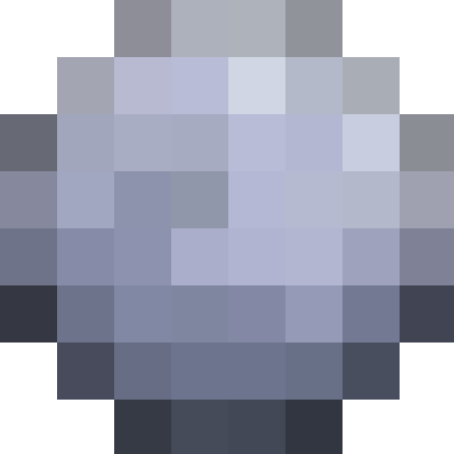

<h1>moonsnap-downloadoor</h1>
<br clear="left"/>

This is a tool for downloading snaps.

## Configuration
Set the following env variables:

```
MOONSNAP_API_BASE_URL=
MOONSNAP_SNAP_KEY=<YOUR_SNAP_KEY>
MOONSNAP_OUT_DIR=<YOUR_OUT_DIR>
```

## Run with docker
`docker run -d ghcr.io/crebsy/moonsnap-downloadoor`

## Run locally without docker
```
go build .
./moonsnap-downloadoor
```
